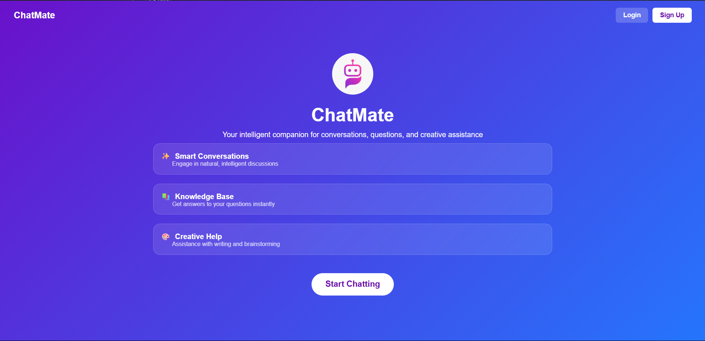
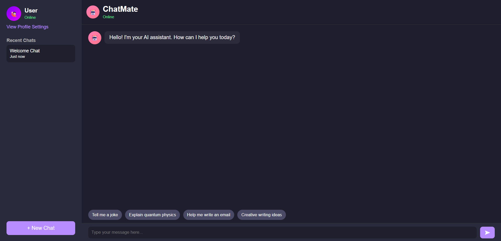
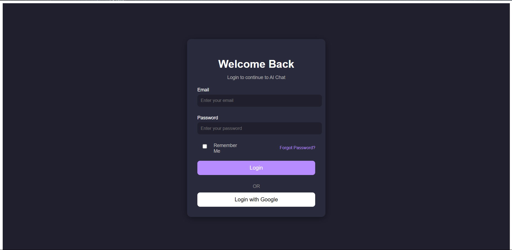

# 🤖 ChatMate – Your Personal AI Chat Assistant

ChatMate is a sleek, responsive **AI chatbot frontend** built with **HTML, CSS, and JavaScript**.  
It provides an interactive chat experience with **Dark/Light Mode**, a modern login page, and profile customization.

---

## ✨ Features
- 🏠 **Home Page** – Clean landing page with a "Start Chatting" CTA.
- 🔑 **Login/Signup Page** – Simple email/password login and simulated Google login.
- 💬 **Chat Page** – Modern chat interface with smooth UI.
- ⚙️ **Profile Settings Modal** – Change name, theme (Dark/Light), and language.
- 🌗 **Dark & Light Mode** – Theme toggle with persistent storage (localStorage).
- 📱 **Fully Responsive UI** – Optimized for both desktop and mobile screens.
- 🔗 **Page Navigation** – Smooth redirects between Home → Login → Chat.

---

## 🖼 Screenshots

### 🔹 Home Page  
  

---

### 🔹 Login Page  
  

---

### 🔹 Chat Interface (Dark Mode)  
  

---

## 🛠 Tech Stack
- **Frontend:** HTML5, CSS3 (Flexbox, responsive design), Vanilla JavaScript
- **Hosting:** GitHub Pages
- **Version Control:** Git & GitHub
  
---

